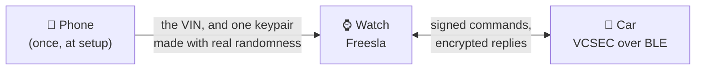
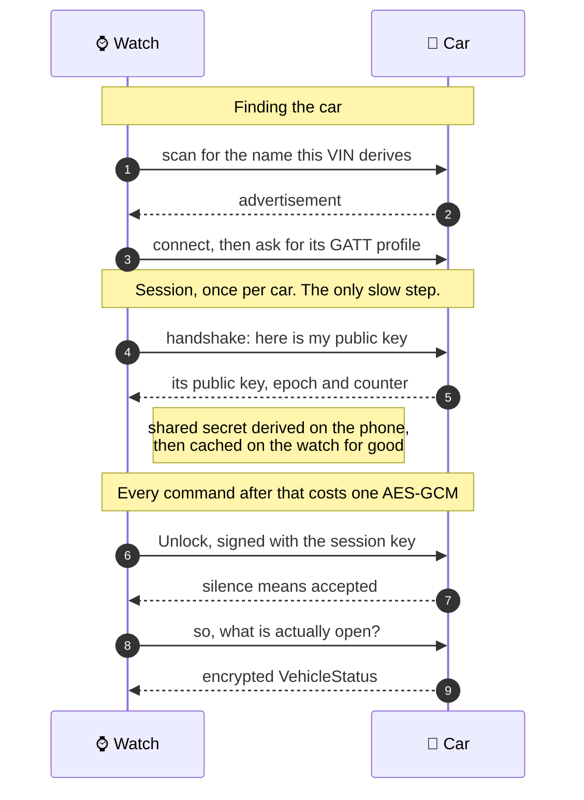
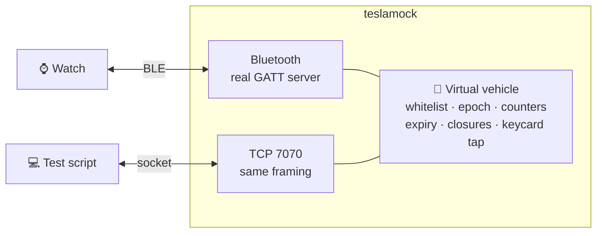

<p align="center">
  <picture>
    <source media="(prefers-color-scheme: dark)" srcset="freesla-gfx/logo-white.png">
    
  </picture>
</p>

<h1 align="center">Freesla</h1>

<p align="center">
  <strong>A Bluetooth key for your Tesla, on your wrist.</strong><br>
  Runs on a Zepp OS watch and talks to the car directly over BLE.
  No phone, no network, no account.
</p>

<p align="center">
  <a href="https://buymeacoffee.com/idct"></a>
</p>

<p align="center">
  Made by <a href="https://idct.tech"><strong>IDCT</strong></a> ·
  <a href="https://github.com/ideaconnect/freesla">github.com/ideaconnect/freesla</a> ·
  BSD-3-Clause
</p>

> [!WARNING]
> **Freesla is free and open source, and always will be.** No accounts, no
> subscription, no telemetry, nothing phoning home. The watch talks to your car
> and to nothing else.
>
> It is developed and maintained in spare time, for free. If you find it useful,
> **[buying me a coffee](https://buymeacoffee.com/idct)** is more than welcome,
> and entirely optional. Stars, bug reports and pull requests help just as much.

Not affiliated with, endorsed by, or sponsored by Tesla, Inc.

## How it works

Your car already accepts phone keys: a Tesla advertises over Bluetooth, and a
key that holds an enrolled private key can prove who it is and ask for the
doors. Freesla is that key, on a watch.



The phone is needed **once**. After that the watch is standalone: it never needs
the phone, a network, or a Tesla account again.

### What happens when you press Unlock



Three things worth knowing from that picture:

- **The car is found by name.** A Tesla advertises `S` + 16 hex characters + `C`,
  derived from a SHA-1 of its VIN. That is why the VIN is the one thing you have
  to type in, and why it cannot be discovered for you.
- **The expensive step happens once.** The shared secret depends only on the two
  keypairs, so it is derived a single time per car and cached. Every unlock
  afterwards is one AES-GCM encryption of about a hundred bytes.
- **Success is silence.** VCSEC acknowledges a command by saying nothing, so
  "sent" is never "done". The app reads the car's status afterwards to find out
  whether anything actually moved.

### Where the pieces live

| | What it is |
|---|---|
| **Watch app** | the key: scan, connect, sign, and the screens you press |
| **Phone companion** | hands over the VIN and, once, a keypair made with real randomness |
| **[mock-car](#mock-car-a-computer-pretending-to-be-a-tesla)** | a computer pretending to be a Tesla, so all of the above can be tested without one |

## Security model: read this before you use it

A Tesla phone key is only useful once **the owner has enrolled its public key in
the car**, and the only way to do that is to tap an already-enrolled NFC keycard
on the centre console. This app has its own P-256 keypair, built on the phone
during setup and then held by the watch, and asks to be enrolled; until someone
with physical possession of a valid keycard approves it, the key is inert.

That is the same position a legitimate phone key is in. Building this client
gives you no way into a car you cannot already open, much as writing an SSH
client gives you no access to servers your key is not on. The protocol itself is
published by Tesla in the [`vehicle-command`](https://github.com/teslamotors/vehicle-command)
SDK, which exists precisely so third parties can build integrations.

The private key is generated on your phone during setup, sent to the watch once,
and lives on the watch from then on. Uninstalling the app destroys it; revoke the
corresponding entry from the Tesla app afterwards. See
[Where the key comes from](#where-the-key-comes-from) for why it is made there
and what that costs.

## Status

| Area | State |
|---|---|
| Protocol implementation | Verified byte-for-byte against Tesla's published test vectors |
| Cryptography | Verified against OpenSSL (Node `crypto`) |
| End-to-end flow | Verified against a mock vehicle, including over fragmented BLE |
| App bundle | Compiles to a `.zab` with the official `zeus` toolchain |
| Real watch BLE | Connects, enrols, unlocks, locks and reads status, against [mock-car](#mock-car-a-computer-pretending-to-be-a-tesla) |
| **Real vehicle** | **Not tested, no car was available** |

That last row is the honest gap, and it is the one that matters: every byte on
the wire has been checked against an independent implementation, but no Tesla
has ever answered it.

Running it on a real watch found five faults in the BLE transport, all of the
same kind: misusing the radio in ways no simulator can reproduce, because the
simulator has no radio to misuse:

- **The connection sequence called a function that is not part of it.**
  `mstBuildProfile` was treated as a declaration, to be followed by
  `mstGetProfileInstance` and `mstPrepare`. It is neither: it *is* the
  discovery, and the profile pointer arrives through the `mstOnPrepare`
  callback, because nothing else produces one. Zepp's own `easy-ble` calls
  exactly those two functions and never mentions the other two, and neither
  appears in the official master-mode flow. So `mstPrepare` was starting a
  second GATT discovery on a profile whose first one was still running, and the
  watch rebooted every time. This is the fault that stopped it connecting at
  all.
- **The profile object was missing three count fields** that the native walker
  reads and the typings do not document: `size`, `len2` and `desc`. `easy-ble`
  marks two of them required. A count read as `undefined` sizes an attribute
  array from whatever was in that memory, and it is only spent later, when
  discovery walks it.
- **Every fragment of a message was written in one synchronous loop**, with
  nothing waiting for the controller to drain. A handshake is a few hundred
  bytes, which at a 20-byte MTU is a dozen back-to-back writes. This is what
  took the whole watch down. Writes are now queued one at a time behind
  `mstOnCharaWriteComplete`, with a timer in case the stack never reports.
- **A connection was opened from inside the scan callback**, while the stack was
  still unwinding the scan. There is now a settle delay between the two.
- **The `mstOn*` callback convention was guessed, and guessed wrong.** Zepp's
  typings declare positional arguments; Zepp's own `easy-ble` reads a single
  object. This code assumed the object form everywhere. Being wrong is silent:
  every field reads back `undefined` and the handler concludes nothing happened.
  `mstOnPrepare` reported a status of `undefined`, which compared unequal to
  `0`, so preparation was declared failed and notifications were never enabled,
  leaving a connection nobody spoke on, which the car dropped a few seconds
  later and the screen reported as **the car being out of range, from the
  driver's seat**. Both conventions are now accepted, and both are tested.

The logic now lives in `lib/zepp/ble-session.js`, which takes the radio API as
an argument and imports no `@zos` module, so it can be driven against a fake
radio. `lib/zepp/ble-transport.js` is just the binding that supplies the real
one. The fake refuses overlapping writes and connecting mid-scan, and faults on
both of the calls that should never be made, so none of it can come back quietly.

One thing in that list is still open. Teardown currently disconnects and then
destroys the profile; the official flow diagram and `easy-ble` both destroy
first, while the connection is still up. The current order was chosen from
reasoning rather than from a source, and the fake radio encodes the same
assumption, so correcting one means correcting both.

## Setup

1. Enter your VIN in the app's settings page in the Zepp phone app. It is the
   only thing the app ever needs to be told. The VIN determines the BLE name
   the car advertises under and is bound into every command signature, so it
   cannot be discovered automatically.
2. Open Freesla on the watch. It collects the VIN from the phone by itself;
   **Check phone** asks again if the phone was not reachable the first time.
3. Tap **Create key**. This takes a few seconds.
4. Stand next to the car and tap **Add to car**, then tap an existing keycard on
   the centre console when the car asks. The watch finds and connects to the car
   on its own, so there is no separate connect step.

After that the watch is standalone. The phone is never needed again.

### Controls

The main screen keeps only lock and unlock, which are what you reach for
walking to the car. Everything that physically moves a panel lives one tap away
behind **Controls**:

| Control | Field | Confirm | Works on |
|---|---|---|---|
| Trunk open | 5 | no | every model; pops the latch even without a powered liftgate |
| Trunk close | 5 | yes | powered liftgate only, silently ignored otherwise |
| Trunk stop | 5 | no | halts a moving panel |
| Frunk open | 6 | yes | every model, but **cannot be closed remotely on any Tesla** |
| Doors open | 1–4 | yes | unlatches on Model 3/Y; a Model X swings them |
| Charge port | 7 | no | every model |

Doors are sent as **four separate single-field messages**, not one multi-field
request. The protobuf permits several fields at once, but Tesla's SDK builds
these from a switch that emits exactly one field, so a multi-field
`ClosureMoveRequest` has never been on the wire from Tesla's own tooling.

### What is deliberately missing

**Doors close** and **frunk close** are not implemented, and shouldn't be. Only a
Model X can pull a door shut, and there the panel is a falcon wing whose
obstruction detection Tesla's manual explicitly declines to promise; on every
other model the command is inert. No Tesla can close a frunk remotely at all,
the bonnet needs a deliberate two-handed press. A button for either would be a
no-op on almost every car and unsafe on the rest.

### Why some controls ask twice

A closure needs confirmation if it is irreversible from the watch, or drives a
panel toward where a person might be. Opening the boot is neither, so it stays a
single tap. Opening the frunk asks first, not because it is dangerous, but
because nothing can undo it remotely. Stop never asks: a confirmation on an abort
control is an anti-feature.

### "Sent" never means "done"

VCSEC acknowledges a command with silence, which proves the message was accepted,
not that a motor turned. A car ignores closures it has no hardware for without
complaining. So the UI says *sent*, and never claims the panel moved.

### Unlock on approach

Optional, off by default, toggled in the phone settings. With Freesla open on the
watch, the car unlocks as you walk up, with no button press. It fires once per
approach and re-arms only after the car has gone out of range, and it ignores a
car that is merely in radio range rather than next to you (an RSSI floor,
default −70 dBm ≈ a few metres). Raise or lower it if it triggers too eagerly or
not eagerly enough.

## Why this was hard

Zepp OS provides **no cryptography whatsoever**: no ECDH, no AES-GCM, no
secure random. Everything the protocol needs had to be written in JavaScript,
under three constraints that ruled out every off-the-shelf library:

- **No BigInt.** The bundled `qjsc` rejects `1n` outright, so 256-bit modular
  arithmetic uses 16 × 16-bit limbs, where a full multiply column stays under
  2^53 and a double represents it exactly. Montgomery multiplication throughout.
- **No `async`/`await`.** Officially unsupported on-device and it hangs the app
  rather than failing, so the protocol client is callback-driven.
- **No JIT.** QuickJS 2020-07-05, a pure interpreter.

The elliptic-curve work is the only slow part, and the watch does none of it.
There are exactly two such operations and both are one-time: generating the
keypair, at pairing, and deriving the ECDH shared secret, on first contact with
a given car. Both happen on the phone and both results are cached on the watch.
the shared secret depends only on the two key pairs, so it stays valid for the
life of both. Every unlock after that costs one AES-GCM encryption of about a
hundred bytes, and needs no phone at all.

The penalty is not the 100× one might assume. A P-256 scalar multiplication is
~14 ms in a phone's JS engine and **~87 seconds** on the Zepp interpreter, and
there is nothing native to fall back on: Zepp OS 3.0 declares twenty-one modules
and not one of them does curves, hashing or randomness. Run on the watch inside
the Bluetooth callback that delivers the car's handshake reply, that block does
not freeze the screen, it resets the watch. `test/watch-workload.test.js` is
the guard that keeps it off the device.

## Layout

### Screens

| Screen | Reached by | Holds |
|---|---|---|
| Main | app launch | status, Unlock, Lock, Controls |
| Controls | Controls button | trunk, frunk, doors, lock, charge port, stop |
| About | tapping the title | IDCT mark, links, licensing, way in to diagnostics |
| Diagnostics | About → Randomness check | the seed check and platform probes |

Artwork is generated by `node tools/make-icons.js`: Font Awesome glyphs for the
controls and the IDCT mark for the About screen, recoloured white for the
watch's dark interface. Zepp OS has no vector drawing and no icon font, so every
glyph is a bitmap baked at build time. The phone settings screen has no asset
pipeline at all, so its images are emitted as inline data URIs into
`setting/assets.js`. See [ATTRIBUTION.md](ATTRIBUTION.md).

```
lib/crypto/     SHA-1, SHA-256/HMAC, AES, GCM, P-256, RNG   (portable, no platform deps)
lib/tesla/      protobuf, framing, metadata, session, messages, client
lib/zepp/       BLE transport and storage                    (imports @zos/*)
lib/app/        identity and the UI state machine
page/           watch UI
setting/        phone settings page (VIN entry)
app-side/       phone companion, relays the VIN and nothing more
tools/          mock vehicle, simulated BLE link, verification script
mock-car/       a computer pretending to be a car: real BLE peripheral, C#
freesla.config.js   build-time settings; one, and only for testing
```

The protocol client talks to an abstract link with `send` and `onMessage`. On
the watch that is BLE; under test it is the mock vehicle. Identical client code
runs on both.

## Build

```
npm install
npm install -g @zeppos/zeus-cli   # the Zepp toolchain, not an npm dependency
zeus build                        # produces dist/*.zab
zeus dev                          # live-reload into the Zepp simulator
```

[`freesla.config.js`](freesla.config.js) is read at build time and inlined into
the bundle. It holds two settings, both off in every committed build:

- `BLE_NAME_OVERRIDE`: the name the watch scans for, instead of the one it
  derives from the VIN. It exists so the watch can be pointed at
  [mock-car](mock-car/README.md) on a Windows machine, which cannot advertise
  under a Tesla's name. A build carrying it will not find a real car.
- `CONNECT_BREADCRUMB`: write each connection step to storage, so a watch that
  restarts mid-connection can say where it stopped. See below; it costs a flash
  write per step, so it is for investigating a fault rather than for shipping.

The rendered artwork under `assets/` and the inlined images in
`setting/assets.js` are generated but **committed**, so a clone builds without
extra steps. Running `node tools/make-icons.js` is optional; it regenerates the
Font Awesome artwork and leaves the IDCT mark alone, since that brand source is
not part of this repository.

Note that the Zepp simulator has no Bluetooth of any kind, so nothing past
"connect" can be exercised there. That is what the mock vehicle is for.

## Testing

```
npm test              # unit, protocol-vector and end-to-end suites
node tools/verify.js  # narrated end-to-end run against the mock vehicle
```

Three things make the tests meaningful rather than self-confirming:

- **Tesla's own test vectors.** The metadata encoding, session-key derivation,
  GCM parameters and a complete 181-byte signed unlock message are all
  reproduced byte-for-byte from the published spec.
- **A different crypto implementation on the other side.** The mock vehicle runs
  every cryptographic operation through OpenSSL, and encodes signature metadata
  independently. A bug in our P-256, AES-GCM or TLV layout shows up as a
  mismatch instead of cancelling out.
- **Real fragmentation.** `tools/ble-link.js` splits traffic into 20-byte writes
  and reassembles from the length prefix, so the framing runs the same path it
  will on a GATT link.

The mock also enforces what a real car enforces (whitelist membership, epoch,
strictly increasing counters, expiry) so rejection paths are covered, including
recovery after the car reboots and rotates its epoch.

## mock-car: a computer pretending to be a Tesla

Developing a car key without a car is the obvious problem, and the Zepp
simulator makes it worse: it has no Bluetooth at all. So `mock-car/` is a small
C# program that **is** a Tesla, as far as a key can tell.



It speaks the real protocol: ECDH over P-256, the SHA-1 session key, AES-GCM
with Tesla's TLV signature metadata, epochs, counters, expiry, the whitelist,
and the NFC keycard tap that guards enrolment.

```
dotnet build mock-car                 # Windows 10 19041+, .NET 8+
npm run verify:mock-car               # the watch's client against it, over a socket
npm run mock-car -- --vin <YOUR VIN>  # be that car; press ? for what the keys do
npm run mock-car -- -v                # trace every GATT operation, with timings
```

**It is a second opinion twice over.** `tools/mock-vehicle.js` is honest
JavaScript talking to JavaScript in one process; this is another language,
another crypto library, another TLV encoder and another process, with the bytes
crossing a socket in 20-byte fragments. Anything the two JavaScript halves agree
on by construction has to survive that too. It also enforces what a real car
enforces, so the rejection paths get exercised without a vehicle present:

| Press | And the car… |
|---|---|
| `k` | accepts the keycard tap that approves a pending enrolment |
| `d` | leaves a door open, and then refuses to lock |
| `r` | reboots, rotating its epoch and voiding every session |
| `n` | rejects the next command as a repeated counter |
| `x` | forgets every enrolled key |

Because it is a real peripheral, it is also the only way to exercise the parts
of the watch that no simulator can reach: the scan, the connect, the GATT
profile, MTU and fragmentation. That is what found the fault that made the watch
reboot. See [When the watch restarts instead of connecting](#when-the-watch-restarts-instead-of-connecting).

**One caveat, and it is Windows':** a program cannot choose the name its own
advertisements carry, and a Tesla is found by name, so the mock advertises under
the machine's own name, whatever VIN it is pretending to have. The way round it
is a build-time setting, `BLE_NAME_OVERRIDE` in
[`freesla.config.js`](freesla.config.js): the name the watch scans for, in place
of the one it derives from the VIN. `teslamock doctor` prints the exact line to
paste, with this machine's name already in it.

Empty it again before building for a real car. A build carrying an override
looks for that name and nothing else, which on the watch looks exactly like a
car out of range. `node tools/verify.js` warns when one is set.

Full documentation, including the measured table of what Windows will and will
not let an application advertise, is in
**[mock-car/README.md](mock-car/README.md)**.

## When the watch restarts instead of connecting

A Zepp watch that trips its watchdog does not report a fault, it reboots, and
the screen, the console and the app's memory go with it. This has happened here
before: the session-key derivation once ran inside the BLE notification callback
for 87 seconds, which the watchdog treated exactly as it should have. Both ends
of the link are now instrumented for it.

**The watch says which step it is on.** "Connecting" used to cover the scan, the
connection, three separate calls declaring and discovering the GATT profile, and
the descriptor write that switches notifications on. Any of these can be the
last thing the watch does, and all of which looked identical. Each is now its
own caption, on screen and in the log, timed from the start of the attempt:

```
[freesla] +0ms    ble scanning: looking for Sade9a822faa374f8C
[freesla] +4ms    ble connecting: found it at -63 dBm
[freesla] +129ms  opening the link
[freesla] +314ms  ble preparing: link open
[freesla] +378ms  declaring the profile          ← mstBuildProfile
[freesla] +505ms  resolving the profile          ← mstGetProfileInstance
[freesla] +631ms  finding the profile on the car ← mstPrepare
[freesla] +821ms  the car answered; registering for notifications
[freesla] +821ms  switching notifications on
[freesla] +821ms  ble ready
```

Each of the three profile calls is announced separately and given a gap before
it, because they used to run as three consecutive statements in one tick, the
only place in that file where consecutive calls into the Bluetooth stack got no
breath between them, while the code either side of them defers by 120ms, 50ms
and 60ms with comments explaining why. `profileSettleMs` (default 120) is the
gap; setting it to `0` restores the old back-to-back behaviour, which is how to
tell whether the gap is doing anything.

Discovery is also bounded now: if `mstPrepare` never calls back, the attempt
fails after `prepareTimeoutMs` (default 8s) instead of leaving the screen on
"finding the profile on the car" with nothing left to move it.

The caption is painted synchronously, including from inside the stack's own
callbacks, because a watch that dies in one never runs a deferred paint, so the
screen would freeze on the step *before* the fatal one. What that costs is kept
down at the other end: a step changes the caption and nothing else, and the page
repaints only the caption when only the caption has changed.

**The car says what it saw.** `teslamock -v` traces the same connection from
outside, with the same elapsed figures, and reports silence out loud.
see [mock-car/README.md](mock-car/README.md#when-the-watch-restarts-instead-of-connecting).
Line the two up: the watch's last caption and the car's last line bracket the
operation between them.

**And a breadcrumb outlives the reboot.** With `CONNECT_BREADCRUMB` on in
[`freesla.config.js`](freesla.config.js), each step is written to storage, and
the next launch reports what the last run never got past:

```
Last run stopped at switching notifications on (+536ms). Tap to try again.
```

That build also stops connecting automatically at launch when it finds one. If
connecting is what restarts the watch, then connecting again the moment it comes
back up is a boot loop its wearer cannot escape, and it paints over the only
evidence of the fault while doing so.

It is off by default for a reason worth knowing before trusting a result: each
step costs a synchronous flash write, and some land inside the Bluetooth
callbacks that a stall in this window is suspected of. Turning it on changes
what is being measured. If the reset gets *worse* with it on, that is itself
the finding.

## Randomness, and why it matters more than the curve maths

Zepp OS provides no cryptographically secure random generator, only
`Math.random()`, which QuickJS seeds once per runtime. That is the weakest link
here, and it is worth being precise about why.

Your **public key travels in the clear** over BLE in every signed command. Anyone
standing near the car can capture it. That hands an attacker a perfect offline
oracle: guess a seed, derive the private key, derive the public key, compare. A
match is a working car key. Weak seeding is therefore not a theoretical concern
it is directly exploitable by anyone who can read a BLE advertisement.

There is a specific reason to think the seed is very weak. QuickJS 2020-07-05,
the engine Zepp ships, seeds `Math.random` **once per JS context, from a single
`gettimeofday` microsecond reading**, and never reseeds. If that is what this
firmware does, then every `Math.random()` output in a run is a pure function of
one number: when the app was launched. Hashing thirty-two of them together adds
nothing, because they are all the same number in disguise.

That has not been confirmed on this watch. It was verified in upstream QuickJS
source, not in Zepp's firmware binary, and Zepp could have patched it. Reviewers
put the odds of the stock behaviour at roughly 70–85%. **So measure it rather
than assume it**, see below.

Three things are done about it:

- **The phone's generator is required, not merely preferred.** The key is drawn
  from `crypto.getRandomValues` on the phone. If no strong source answers,
  **generation is refused** rather than quietly producing a guessable key.
- **There is no fallback, and that is the point.** An earlier version had the
  phone send 48 bytes of entropy for the watch to build its own key from,
  seeded `SHA-256(phone ‖ watch)`. It was removed: it needed the two things
  this platform is worst at, a secure generator it does not have and ninety
  seconds of scalar multiplication, and a key that is merely *probably*
  unguessable is worse than none, because the car trusts it exactly like a
  real one. If the phone cannot produce a key, the watch says so and stops.
- **BLE scan observations are still mixed in**, but only for routing addresses
  and request uuids, never for key material, which no longer originates here.
  Nearby device addresses and signal strengths are the least predictable thing
  the watch can see unaided.
- **A diagnostics screen measures the real behaviour.** Tap the title on the
  main screen.

### Where the key comes from

The keypair is built on the phone and sent to the watch once, during setup.

This is a deliberate trade, and it is worth stating plainly. The elliptic-curve
maths is identical on both sides (the same `lib/crypto/p256.js`) but the
scalar multiplication that derives the public key was measured at **87 seconds**
on the Zepp device runtime against **12 ms** under Node. That is the interpreter,
not the algorithm. Ninety seconds of setup during which the watch cannot repaint
is not something to ask of anyone, so the work goes where it is quick.

There is no watch-side fallback, and that is deliberate. The alternative the app
used to implement, the phone sending only entropy and the watch deriving the key
itself, kept the private key off the link, but it needed the two things this
platform is worst at: a secure generator it does not have, and ninety seconds of
scalar multiplication. A key made without the first is worse than no key,
because the car trusts it exactly like a real one.

What it costs: the private key crosses the Bluetooth link. Anyone who captures
one of those messages holds a working car key. It crosses at setup, and again
the first time the watch meets a particular car. The ECDH has to happen where
the maths is affordable, and the phone does not keep the key afterwards.

Practical advice: do the one-time setup, and the first unlock of a given car,
somewhere you would be comfortable unlocking it anyway. After that the phone is
never involved again, and enabling PIN to Drive protects you regardless of what
any key can do.

The watch does not take the phone's word for the key. The private key must be a
valid scalar and the public key a real point on the curve, both checked before
anything is stored. What is deliberately *not* checked is that the two halves
correspond, since verifying that means deriving the public key, the 87 seconds
this exists to avoid. A mismatched pair simply fails at enrolment, visibly.

### Run the randomness check first

Tap **Freesla** on the main screen, then close the app completely and reopen it
and look again. The second reading is the one that counts:

| Verdict | Meaning |
|---|---|
| `Baseline saved` | First run. Restart the app and look again. |
| `FIXED SEED` | The generator restarts identically every launch. **Do not enrol a key.** |
| `Seed space small` | A previous sample reappeared. Treat any key as weak. |
| `Seed varies` | The seed is not constant. Necessary, but it does **not** prove the seed is hard to guess. |

The same screen reports whether a secure RNG or BigInt exists and how many
distinct clock deltas a jitter loop produces. All of it is also written to the
console log.

It used to time a P-256 scalar multiplication too. That measurement answered its
question (about 87 seconds) by taking the watch down with the watchdog every
time it ran, so the number could only be read from the log of a device that had
just rebooted. The answer is settled and the app no longer performs the
operation, so the benchmark is gone.

Be careful reading `Seed varies`: it is exactly what clock seeding looks like.
The timestamp differs every launch, so the samples differ, and the cross-restart
check passes while the key remains guessable. That is why the next test exists.

### Prove it, don't infer it

The diagnostics screen also shows a **seed check** line: a millisecond clock
reading and the first two `Math.random()` outputs of that launch, captured in
`app.js` before anything else can touch the generator. Feed them to:

```
node tools/invert-seed.js <at-ms> <r1-hex> <r2-hex>
```

This searches microsecond timestamps for one whose xorshift64\* stream
reproduces both outputs. A **HIT is proof** that the generator is clock-seeded
and that every watch-generated key is only as unguessable as the moment it was
made. An attacker with your public key runs the same search against it. Finding
a known seed among 3 million candidates takes about 0.2 s.

A **NO MATCH** over a generous window shows the firmware does not seed this way.
That is encouraging, not a clean bill of health: it rules out this particular
seeding, not a small seed space in general.

## Known gaps

- **Randomness is the weak point, see below.** This is the most serious open
  issue in the project and the one to satisfy yourself about before enrolling
  a key.
- **Auto-unlock needs the app open.** Walk-up unlock with no button press works
  and is implemented, but only while Freesla is on screen: Zepp OS cannot run
  BLE central from a background service and closes a foreground app about ten
  seconds after the screen dims. Truly pocketable passive entry is not possible
  on this platform.
- **One connection at a time**, and only the VCSEC domain (lock, unlock, trunk,
  frunk, wake) is implemented. Climate and charging live in the infotainment
  domain and would need a second session.
- The BLE transport works around documented-API disagreements. `mstBuildProfile`
  must follow `mstOnPrepare` with a short delay, which comes from Zepp's own
  library rather than their docs. The `mstOn*` argument convention is the other,
  and this used to state confidently that the callbacks deliver a single object
  rather than positional arguments. That claim came from reading `easy-ble`,
  not from a watch, and on a watch it did not hold. The transport now accepts
  either shape rather than asserting which is right; see
  [Status](#status).

## Licence

Freesla's source is [BSD-3-Clause](LICENSE), copyright IDCT Bartosz Pachołek.

Three things are deliberately **not** under that licence, and are set out in
[ATTRIBUTION.md](ATTRIBUTION.md): the Freesla and IDCT brand marks, which are
trademarks; the icon artwork, which stays CC BY 4.0 under Font Awesome's terms;
and `@zeppos/zml`, which is Apache-2.0 and compiled into the built app.

If you publish your own build, replace the brand marks.

## Disclaimer

Provided as is, with no warranty of any kind.

**Freesla is not a safety device.** It commands powered closures that physically
move. Do not use it where a moving panel could reach a person or an animal, and
do not rely on it as your only means of getting into your car. Carry your
keycard.

The app has never been tested against a real vehicle or on real watch hardware
(see [Status](#status)). Enrolling a key is your decision and your risk.

Not affiliated with, endorsed by, or sponsored by Tesla, Inc.
